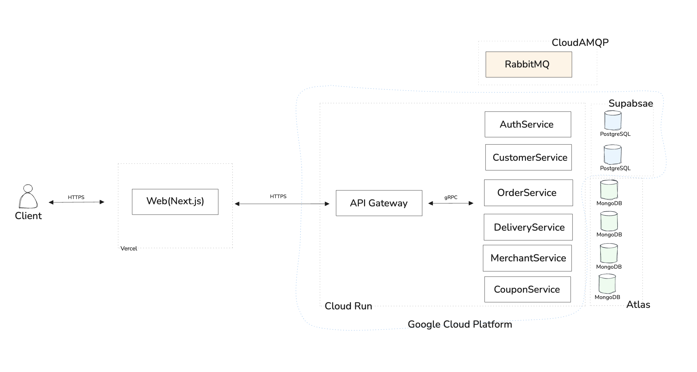

# IHAVEFOOD

ihavefood is a microservice food-delivery project written in Go,Rust and TypeScript.

## Purpose

This is a personal learning project focused on building and designing a microservice-based system.

## Design

- **API Gateway** – entry point for clients, routes HTTP requests to gRPC services and validates authentication tokens
- **AuthService** – handles user registration, login, and token issuance
- **CustomerService** – manages customer profiles, addresses, and social information
- **CouponService** – handles coupon listing, validation, and redemption
- **MerchantService** – manages merchants, menus, and store status
- **OrderService** – handles order creation and order history
- **DeliveryService** – delivery fee calculation, rider tracking, and delivery status

## Web

Use Next.js to learn SEO, TypeScript for type safety and shadcn/ui components to avoid manually
writing html/css. Deploy with Vercel, which integrates well with the framework.

## Tech Stack

- **Languages:** Go, Rust, TypeScript
- **Databases:** PostgreSQL, MongoDB
- **Message Broker:** RabbitMQ
- **Deployment:** Google Cloud Platform (GCP), Vercel

## Future Improvements

- [ ] Refactor frontend code
- [ ] Add unit tests, load tests and performance testing
- [ ] Implement rider status feature in the web UI
- [ ] Error handling in Next.js
